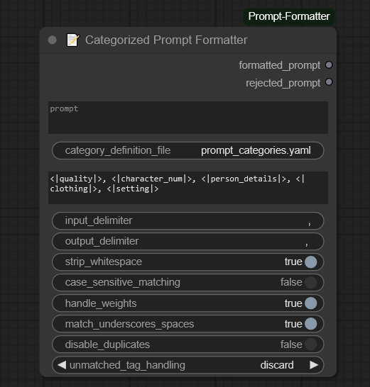
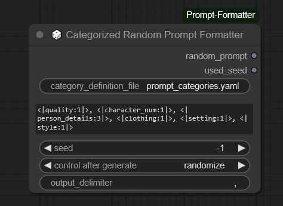
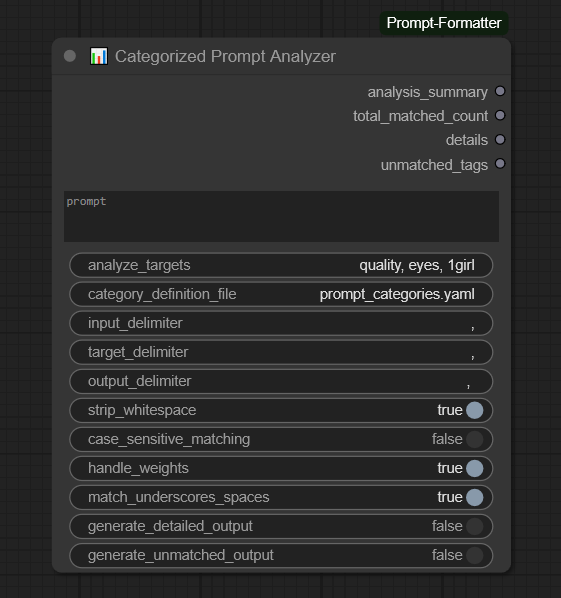
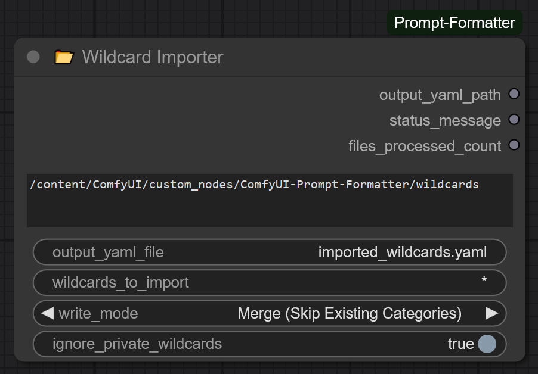

# 📝🎲📊📂 ComfyUI Prompt Formatting & Analysis Nodes

This repository contains custom nodes for ComfyUI designed to help structure, filter, generate, and **analyze** text prompts using categorized tag definitions stored in a YAML file.

## Nodes Included

1.  **📝 Categorized Prompt Formatter:** Filters and restructures an *existing* input prompt based on categories and a template. Preserves tag details like weights.
2.  **🎲 Categorized Random Prompt Formatter:** *Generates* a new random prompt by sampling tags from categories defined in the YAML, using a template structure and a seed for reproducibility.
3.  **📊 Categorized Prompt Analyzer:** *Analyzes* an input prompt to count occurrences of specific tags or tags belonging to specified categories.
4.  **📂 Wildcard Importer:** A utility node that scans a directory of `.txt` wildcard files and converts them into a single, structured YAML file, making it easy to use existing wildcard collections with this node pack.

---

## Key Features (Overall)

*   **YAML-based Categorization:** Define tags belonging to specific categories (e.g., `eyes`, `style`, `quality`) in an easy-to-edit YAML file.
*   **Hierarchical Categories (`$category`, `$include`):** Define broad categories that automatically inherit tags from more specific ones without manual repetition in the YAML, using either list-based or dictionary-based includes.
*   **Inline Tag Expansion:** Generate combinatorial tags within the YAML itself (e.g., `$color eyes`).
*   **Template-Driven Output (Formatter/Random):** Control the structure of the output prompt using simple placeholders like `<|category_name|>`.
*   **Flexible Tag Handling:** Options for case sensitivity and matching tags regardless of underscores vs. spaces (e.g., `blue_eyes` vs `blue eyes`).
*   **Wildcard Integration:** Use the **Wildcard Importer** node to automatically convert entire folders of standard `.txt` wildcards into a compatible YAML file.

---

## The YAML Definitions File (`prompt_categories.yaml`)

All nodes rely on a YAML file to define which tags belong to which categories. An example file (`prompt_categories.yaml`) is included in this repository.

**Format:**

*   **Basic:**
    ```yaml
    category_name:
      - tag1
      - tag2
    ```
*   **Hierarchical Inclusion (`$category`):** A category list can include all tags from another category by adding `$other_category_name` as an item.
    ```yaml
    list_one:
      - tag_a
    list_two:
      - $list_one # Includes tag_a
      - tag_b
    ```
*   **Inline Tag Expansion (`prefix $category suffix`):** You can generate tags combinatorially within a string. The node finds the first `$category_name` reference in the string, resolves all tags for that category, and substitutes each one back into the string pattern.
    ```yaml
    colors:
      - red
      - blue
    items:
      - ball
      - cube
    colored_items:
      - $colors $items # Expands to: red ball, blue ball, red cube, blue cube
      - shiny $colors sphere # Expands to: shiny red sphere, shiny blue sphere
    # Note: Currently supports only one $category reference per line for expansion.
    #       '$category' at the start of a line with no other text is treated as a full list include.
    ```
*   **Dictionary Includes (`$include`/`tags:`):** The older dictionary format for includes is also supported for backward compatibility.
    ```yaml
    eyes:
      - blue eyes
      - red eyes
    person_details:
      $include: # Inherit from 'eyes'
        - eyes
      tags: # Add tags specific to 'person_details'
        - smiling
        - freckles
    ```

**File Location:**

The nodes will search for the specified YAML file in this order:
1.  Absolute path (if provided).
2.  Relative to the node pack's directory (`ComfyUI/custom_nodes/ComfyUI-Prompt-Formatter/`).
3.  Relative to the main ComfyUI `input/` directory.

**Example File:** See the included [prompt_categories.yaml](prompt_categories.yaml) for a comprehensive example.

---

## 1. 📝 Categorized Prompt Formatter

This node takes an existing prompt string, analyzes its tags against your YAML definitions, and reconstructs a new prompt based on your template, applying various filtering options.



### Inputs & Widgets

*   `prompt` (String): The input prompt string (e.g., "1girl, masterpiece, blue_eyes, smiling...").
*   `category_definition_file` (String): Name or path to your category YAML file (e.g., "prompt_categories.yaml").
*   `output_template` (String): Defines the output structure using placeholders.
    *   `<|category_name|>`: Includes all matched tags for this category.
    *   `<|category_name:N|>`:
        *   If N > 0: Includes **at most** the **first N** matched tags.
        *   If N < 0: Includes **at most** the **last `abs(N)`** matched tags.
        *   If N = 0: Includes **no** tags for this category.
*   `input_delimiter` (String): Character(s) separating tags in the input `prompt` (Default: `,`).
*   `output_delimiter` (String): Character(s) used to join tags in the output `formatted_prompt` (Default: `, `).
*   `strip_whitespace` (Boolean): Remove whitespace around input tags before matching (Default: True).
*   `case_sensitive_matching` (Boolean): Match tags case-sensitively against YAML (Default: False).
*   `handle_weights` (Boolean): Parse and preserve weights like `(tag:1.2)` or `[tag]` (Default: True).
*   `match_underscores_spaces` (Boolean): Treat `tag_one` and `tag one` as equivalent during matching (Default: True). Output preserves original format.
*   `disable_duplicates` (Boolean): Prevent the same tag string from appearing multiple times in the output (first occurrence wins) (Default: False).
*   `unmatched_tag_handling` (Dropdown): What to do with input tags not used by the template:
    *   `discard`: Ignore them (Default).
    *   `append_end`: Add them all to the end of the formatted prompt.
    *   `output_separately`: Output them in the `rejected_prompt` slot.

### Outputs

*   `formatted_prompt` (String): The restructured prompt based on the template.
*   `rejected_prompt` (String): Tags not included in `formatted_prompt` (content depends on `unmatched_tag_handling`).

### Example Usage

*   **Input Prompt:** `"masterpiece, 1girl, blue eyes, red eyes, smiling, detailed background, anime style, illustration"`
*   **YAML:** (Assumes `quality`, `character_num`, `eyes`, `person_details`, `style` categories exist)
*   **Template:** `<|quality:1|>, <|character_num|>, <|eyes:-1|>, <|style:1|>`
*   **Unmatched Handling:** `output_separately`
*   **Disable Duplicates:** `False`

*   **Result (`formatted_prompt`):** `"masterpiece, 1girl, red eyes, anime style"`
*   **Result (`rejected_prompt`):** `"blue eyes, smiling, detailed background, illustration"` (Assuming 'smiling', 'detailed background' weren't matched or used; 'blue eyes' was dropped by the limit `-1`; 'illustration' dropped by limit `1`)

---

## 2. 🎲 Categorized Random Prompt Formatter

This node generates completely new, random prompts by selecting tags from your YAML categories based on a template structure and a seed.



### Inputs & Widgets

*   `category_definition_file` (String): Name or path to your category YAML file.
*   `output_template` (String): Defines the structure and *how many* random tags to pick per category.
    *   `<|category_name|>`: Picks **1** random tag from the category.
    *   `<|category_name:N|>`: Picks **N** unique random tags from the category (N >= 0). If fewer than N tags exist, picks all available. N=0 picks none.
*   `seed` (Int): Seed for the random number generator. 0 generates a new random seed each run; any other value provides reproducible results.
*   `output_delimiter` (String): Character(s) used to join the selected random tags (Default: `, `).

### Outputs

*   `random_prompt` (String): The generated random prompt string.
*   `used_seed` (Int): The actual seed used for generation (useful if input `seed` was 0).

### Example Usage

*   **YAML:** (Assumes standard categories exist)
*   **Template:** `<|quality:1|>, <|character_num:1|>, <|hair_style:2|>, <|setting:1|>`
*   **Seed:** `42`

*   **Possible Result (`random_prompt`):** `"best quality, 1girl, long hair, twintails, outdoors"` (Specific tags depend on seed 42 and YAML content)
*   **Result (`used_seed`):** `42`

---

## 3. 📊 Categorized Prompt Analyzer

This node inspects an input prompt and counts how many tags match specific targets, which can be literal tag strings or category names from your YAML file. It's useful for debugging prompts, verifying content, or understanding composition.

 

### Inputs & Widgets

*   `prompt` (String): The input prompt string to analyze.
*   `analyze_targets` (String): A comma-separated list of targets to count.
    *   If a target matches a category name in the YAML, it counts all tags from the prompt belonging to that category.
    *   Otherwise, it's treated as a literal tag to search for.
    *   *Example:* `"quality, eyes, 1girl, (specific tag:1.1)"`
*   `category_definition_file` (String): Path to your category YAML file (required if using category targets).
*   `input_delimiter` (String): Separator for tags in the input `prompt` (Default: `,`).
*   `target_delimiter` (String): Separator for items in the `analyze_targets` string (Default: `,`).
*   `output_delimiter` (String): Separator used in the string outputs (`details`, `unmatched_tags`) (Default: `, `).
*   `strip_whitespace` (Boolean): Remove whitespace around input prompt tags (Default: True).
*   `case_sensitive_matching` (Boolean): Apply case sensitivity to tag/category matching (Default: False).
*   `handle_weights` (Boolean): If True, `(tag:1.1)` will match the target `tag` (Default: True).
*   `match_underscores_spaces` (Boolean): Treat `tag_one` and `tag one` as equivalent during matching (Default: True).
*   `generate_detailed_output` (Boolean): If True, populate the `details` output string (Default: False).
*   `generate_unmatched_output` (Boolean): If True, populate the `unmatched_tags` output string (Default: False).

### Outputs

*   `analysis_summary` (String): A summary of counts for each target (e.g., `"quality: 2, eyes: 1, 1girl: 1"`).
*   `total_matched_count` (Int): The total number of tag occurrences counted across all targets. Note: If one input tag matches multiple targets (e.g., literal 'blue eyes' and category 'eyes'), it contributes to the count of *each* target but only once to this total sum if desired (or sum of individual counts - clarify based on implementation). *Current implementation likely sums individual counts.*
*   `details` (String): (Optional) A more detailed breakdown showing which specific input tags were counted for each target (e.g., `"quality: 2 [masterpiece, best quality]\neyes: 1 [(blue eyes:1.1)]"`). Formatted with newlines between targets.
*   `unmatched_tags` (String): (Optional) A comma-separated list of tags from the input prompt that did not match any specified target.

### Example Usage

*   **Input Prompt:** `"masterpiece, best quality, 1girl, solo, (blue eyes:1.1), blue_eyes, anime style"`
*   **YAML:** Defines `quality` (incl. masterpiece, best quality), `eyes` (incl. blue eyes), `style` (incl. anime style).
*   **Analyze Targets:** `"quality, blue_eyes, style, non_existent_category"`
*   **Settings:** Defaults (case insensitive, handle weights, match underscores/spaces). `generate_detailed_output=True`, `generate_unmatched_output=True`.

*   **Result (`analysis_summary`):** `"quality: 2, blue_eyes: 2, style: 1, non_existent_category: 0"`
*   **Result (`total_matched_count`):** `5`
*   **Result (`details`):** (Formatted with newlines)
    ```
    quality: 2 [masterpiece, best quality]
    blue_eyes: 2 [(blue eyes:1.1), blue_eyes]
    style: 1 [anime style]
    non_existent_category: 0 []
    ```
*   **Result (`unmatched_tags`):** `"1girl, solo"`

---

## 4. 📂 Wildcard Importer

This utility node is designed to bridge the gap between this node pack and the vast ecosystem of existing wildcard `.txt` files. It scans a directory, reads the wildcard files, and converts them into a single, structured YAML file that the other nodes can use.

 

### Self-Contained by Default

To make the node pack easy to use out-of-the-box, the **Wildcard Importer** is configured with new defaults:

*   **Default Wildcard Folder:** It defaults to looking for wildcards in a `wildcards/` subfolder *within this node pack's directory* (`ComfyUI/custom_nodes/ComfyUI-Prompt-Formatter/wildcards/`). You can place your `.txt` wildcard files here.
*   **Default Output Location:** It saves the generated YAML file (e.g., `imported_wildcards.yaml`) directly inside this node pack's main directory.
*   **Other Nodes' Defaults:** The Formatter, Random, and Analyzer nodes now default to using `imported_wildcards.yaml`, making it seamless to create a workflow pipeline.

### Inputs & Widgets

*   `wildcard_directory` (String): The path to the folder containing your `.txt` wildcard files.
*   `output_yaml_file` (String): The name for the output YAML file to be saved within this node pack's directory.
*   `wildcards_to_import` (String): A comma-separated list of wildcard filenames to import (without `.txt`). Use `*` to import all.
*   `write_mode` (Dropdown): How to handle the output file if it already exists:
    *   `Overwrite`: Deletes the existing file and creates a new one (Default).
    *   `Merge (Skip Existing Categories)`: Adds new categories from wildcards, but skips any wildcard if a category with that name already exists in the YAML.
    *   `Merge (Overwrite Existing Categories)`: Overwrites existing categories in the YAML with content from the corresponding wildcard file. Adds new ones.
    *   `Merge (Append Unique Tags)`: Appends only new, unique tags from a wildcard file to an existing category in the YAML.
*   `ignore_private_wildcards` (Boolean): If True, skips importing wildcard files that start with an underscore (`_`), which are often used as helpers (Default: True).

### Outputs

*   `output_yaml_path` (String): The full, absolute path to the generated YAML file. **This can be directly connected to the `category_definition_file` input of the other nodes.**
*   `status_message` (String): A human-readable summary of the import operation.
*   `files_processed_count` (Int): The number of wildcard files that were successfully imported.

### Example Usage

1.  Place your collection of `.txt` wildcards into the `ComfyUI/custom_nodes/ComfyUI-Prompt-Formatter/wildcards/` folder.
2.  In ComfyUI, add a **📂 Wildcard Importer** node. Keep the default settings.
3.  Add a **🎲 Categorized Random Prompt Formatter** node.
4.  Connect the `output_yaml_path` from the Importer to the `category_definition_file` input of the Random Formatter.
5.  Run the workflow. The Importer will create `imported_wildcards.yaml`, and the Random Formatter will immediately be able to use the newly imported categories to generate a random prompt.

---

## Notes & Troubleshooting

*   **YAML Not Found:** If a node prints a warning about not finding the YAML file, double-check the filename/path and ensure it's accessible (in the node pack folder, `ComfyUI/input/`, or an absolute path).
*   **Restart Required:** Always restart ComfyUI after installing or updating custom nodes.
*   **`$include`/`$category` Cycles:** The code has basic protection against circular references in the YAML. If detected, a warning is printed, and the cycle is broken.
*   **Tag Order (Formatter):** When using limits (`<|cat:N|>`) or duplicate prevention in the Formatter node, the order of tags *in the input prompt* determines which ones are selected first or last.
*   **Tag Format Preservation (Formatter):** The Formatter node preserves the exact format (including weights, underscores/spaces) of the *input tags* when placing them in the output, even if matching used variants (lowercase, space/underscore swap).
*   **Analyzer Counts:** The Analyzer counts each *occurrence* of a matching tag in the input prompt towards the relevant target(s). If one input tag matches multiple specified targets (e.g., a literal tag *and* a category it belongs to), it increments the count for *each* of those targets.
